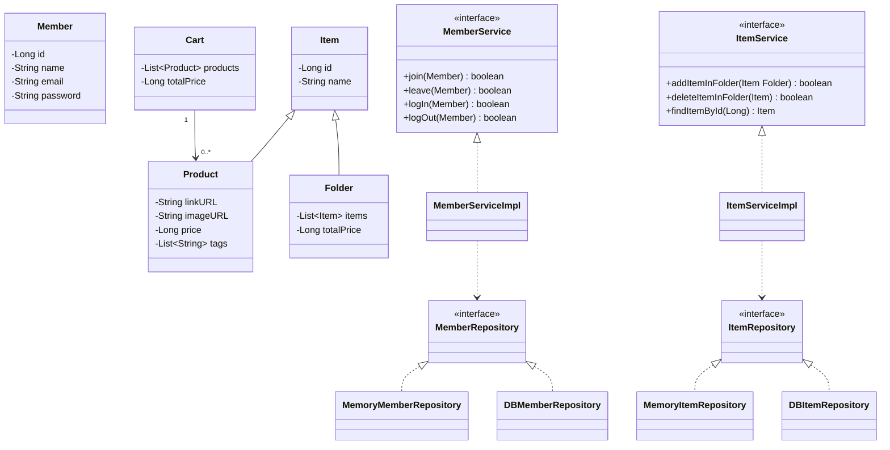

```mermaid

classDiagram

%% 회원
class Member
Member : -Long id
Member : -String name
Member : -String email
Member : -String password

%% 상품과 폴더를 하나의 아이템으로 보아 정리할 예정
class Item
Item : -Long id
Item : -String name

%% 아이템을 상속하는 상품
class Product
Item <|-- Product
Product : -String linkURL
Product : -String imageURL
Product : -Long price
Product : -List~String~ tags

%% 아이템을 상속하는 폴더
class Folder
Item <|-- Folder
Folder : -List~Item~ items
Folder : -Long totalPrice

%% 상품을 담아둘 수 있는 장바구니
class Cart
Cart : -List~Product~ products
Cart : -Long totalPrice

%% 회원 관리 인터페이스
class MemberService
<<interface>> MemberService
MemberService : +join(Member) boolean
MemberService : +leave(Member) boolean
MemberService : +logIn(Member) boolean
MemberService : +logOut(Member) boolean

class MemberServiceImpl

%% 회원정보 저장소 인터페이스
class MemberRepository
<<interface>> MemberRepository

class MemoryMemberRepository
class DBMemberRepository

%% 아이템 관리 인터페이스
class ItemService
<<interface>> ItemService
ItemService : +addItemInFolder(Item Folder) boolean
ItemService : +deleteItemInFolder(Item) boolean
ItemService : +findItemById(Long) Item

class ItemServiceImpl

%% 아이템 저장소 인터페이스
class ItemRepository
<<interface>> ItemRepository

class MemoryItemRepository
class DBItemRepository

%% 관계도
Cart "1"-->"0..*" Product

MemberService <|.. MemberServiceImpl
MemberRepository <|.. MemoryMemberRepository
MemberRepository <|.. DBMemberRepository
MemberServiceImpl ..> MemberRepository

ItemService <|.. ItemServiceImpl
ItemRepository <|.. MemoryItemRepository
ItemRepository <|.. DBItemRepository
ItemServiceImpl ..> ItemRepository


```
